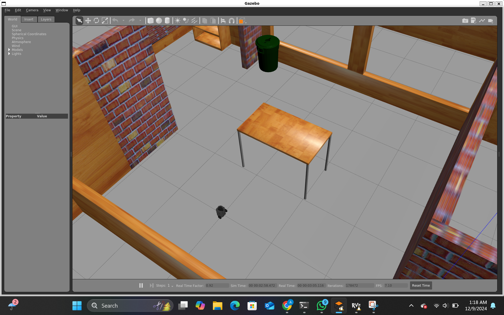
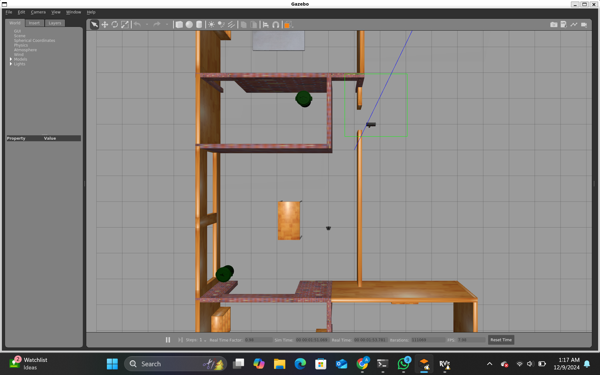

# 🤖 Multi-Robot SLAM & Autonomous Navigation

<div align="center">


**Synchronization and Coordination of Two Mobile Robots using ROS, SLAM, and Autonomous Navigation**

*EECE 5554 – Robotic Sensing & Navigation · Northeastern University*

[📄 Project Report](#) · [📽️ Demo Video](#) · [🗺️ Results](#results) · [🚀 Getting Started](#getting-started)

</div>

---

## 📸 Gallery

<div align="center">

| SLAM + Navigation (RViz) | Gazebo Simulation World |
|:---:|:---:|
|  |  |

| Autonomous Path Planning | Robot POV Navigation |
|:---:|:---:|
|  |  |

| Combined RViz + Gazebo View | Costmap & DWA Planner |
|:---:|:---:|
|  |  |

</div>

---

## 🎥 Demo Videos

> **Add your demo videos here. Recommended format:**

```
[](https://www.youtube.com/watch?v=YOUR_VIDEO_ID)
```

| Single Robot Navigation | Dual Robot SLAM | Map Merging |
|:---:|:---:|:---:|
| *(add video link)* | *(add video link)* | *(add video link)* |

---

## 📖 About

This project investigates the **synchronization and coordination of two TurtleBot3 mobile robots** tasked with independently executing SLAM, exploration, and autonomous navigation within a shared simulated environment — followed by the merging of their respective maps.

The system was built on top of the **ROS (Robot Operating System)** framework and tested inside a custom **Gazebo** world. Each robot runs its own SLAM pipeline (Gmapping), AMCL localization, and `move_base` navigation stack, isolated via ROS namespaces to prevent TF frame conflicts.

### 🔬 Key Highlights

- ✅ Dual TurtleBot3 robots spawned in a custom Gazebo house world
- ✅ Independent SLAM via `gmapping` per robot using ROS namespaces
- ✅ Autonomous navigation via `amcl` + `move_base` + DWA local planner
- ✅ Real-time costmap visualization in RViz (local + global maps)
- ✅ Map merging attempted via `multirobot_map_merge`
- ⚠️ TF frame conflict resolution through namespace isolation
- ⚠️ Autonomous frontier exploration partially implemented (`explore_lite`)

---

## 🧰 Tech Stack

| Tool | Purpose |
|---|---|
| **ROS Noetic** | Middleware framework for robot communication |
| **Gazebo** | Physics-based 3D simulation environment |
| **TurtleBot3 (Burger)** | Differential-drive mobile robot platform |
| **Gmapping** | Particle-filter based 2D SLAM |
| **AMCL** | Adaptive Monte Carlo Localization |
| **move_base** | Navigation stack with global/local planners |
| **DWA Planner** | Dynamic Window Approach local planner |
| **RViz** | ROS visualization tool |
| **multirobot_map_merge** | Map merging for multi-robot systems |
| **explore_lite** | Frontier-based autonomous exploration |

---

## 🏗️ System Architecture

```
                    ┌─────────────────────────────────────┐
                    │         Gazebo Simulation            │
                    │   ┌──────────┐   ┌──────────┐       │
                    │   │  Robot 1 │   │  Robot 2 │       │
                    │   │ (tb3_1)  │   │ (tb3_2)  │       │
                    └───┴────┬─────┴───┴────┬─────┴───────┘
                             │               │
               ┌─────────────┘               └────────────────┐
               ▼                                               ▼
    ┌──────────────────┐                         ┌──────────────────┐
    │  Namespace: tb3_1│                         │  Namespace: tb3_2│
    │  - gmapping      │                         │  - gmapping      │
    │  - amcl          │                         │  - amcl          │
    │  - move_base     │                         │  - move_base     │
    └────────┬─────────┘                         └────────┬─────────┘
             │  /tb3_1/map                                │  /tb3_2/map
             └──────────────────┬────────────────────────┘
                                ▼
                    ┌───────────────────────┐
                    │   multirobot_map_merge │
                    │   publishes → /map    │
                    └───────────┬───────────┘
                                ▼
                    ┌───────────────────────┐
                    │         RViz          │
                    │  (Visualization)      │
                    └───────────────────────┘
```

---

## 🚀 Getting Started

### Prerequisites

- Ubuntu 20.04
- ROS Noetic (full desktop install)
- Gazebo 11
- TurtleBot3 packages

```bash
sudo apt install ros-noetic-turtlebot3 ros-noetic-turtlebot3-simulations
sudo apt install ros-noetic-slam-gmapping ros-noetic-navigation
sudo apt install ros-noetic-multirobot-map-merge ros-noetic-explore-lite
```

### Installation

```bash
# Clone the repository
git clone https://github.com/YOUR_USERNAME/multi-robot-slam.git
cd multi-robot-slam

# Build the workspace
catkin_make
source devel/setup.bash
```

### Running the Simulation

**1. Launch the Gazebo world with both robots:**
```bash
export TURTLEBOT3_MODEL=burger
roslaunch multi_robot_nav multi_robot_gazebo.launch
```

**2. Start SLAM for both robots:**
```bash
roslaunch multi_robot_nav multi_robot_slam.launch
```

**3. Launch autonomous navigation:**
```bash
roslaunch multi_robot_nav multi_robot_navigation.launch
```

**4. Set initial pose and visualize in RViz:**
```bash
rosrun auto_nav init_pose.py
rviz -d config/turtlebot3_auto_nav.rviz
```

---

## 📊 Results

### Single Robot Navigation
Autonomous navigation using AMCL + move_base was successfully implemented for a single TurtleBot3, with accurate obstacle avoidance and goal-reaching behavior via the DWA local planner.

### Dual Robot SLAM
Both robots were successfully spawned in the same Gazebo world using distinct ROS namespaces, enabling independent SLAM pipelines without TF frame conflicts.

### Map Merging
Individual maps from both robots were published and processed through `multirobot_map_merge`. Full autonomous frontier exploration between both robots encountered TF communication issues between `slam_gmapping` and `explore_lite`.

---

## 👥 Team

| Name | GitHub |
|---|---|
| Ahilesh Vadivel | [@ahilesh](https://github.com/) |
| Siyu Liu | [@siyuliu](https://github.com/) |
| Jorge Ortega | [@jorgeortega](https://github.com/) |
| Sachidanand Halhalli | [@sachidanand](https://github.com/) |

*EECE 5554 – Robotic Sensing & Navigation, Northeastern University, Fall 2024*

---

## 📚 References

- Quigley et al. (2009). *ROS: An open-source Robot Operating System*. ICRA Workshop.
- Koenig & Howard (2004). *Design and Use Paradigms for Gazebo*. IEEE/RSJ IROS.
- Thrun, Burgard & Fox (2005). *Probabilistic Robotics*. MIT Press.
- [TurtleBot3 Documentation](https://emanual.robotis.com/docs/en/platform/turtlebot3/)

---

<div align="center">
<sub>Built with ❤️ at Northeastern University · EECE 5554 Robotic Sensing & Navigation · Fall 2024</sub>
</div>
